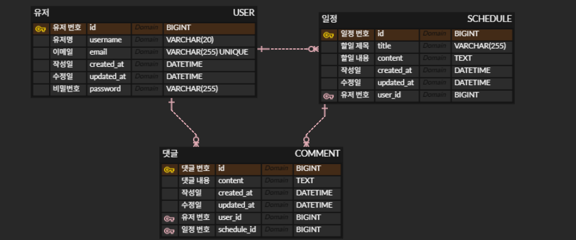

# Innorun Spring Assignment

## 기술 스택

| 구분 | 기술 |
| :--- | :--- |
| Language | Java 21 |
| Framework | Spring Boot 4.1.0 |
| Database | MySQL 8.0 |
| ORM | Spring Data JPA |
| Build Tool | Gradle |

## ERD

  

## API Specification

[API 명세서 보기](https://Hseok-2.github.io/innorun-ps-project/)

## 주요기능
- Schedule CRUD API
  - 일정 등록, 전체/단건 조회, 수정, 삭제 기능
  - userId 쿼리 파라미터를 활용한 특정 유저의 일정 필터링 조회
  - 데이터가 없는 경우 예외 대신 빈 배열과 200 OK 반환
- User CRUD API
  - BCrpt를 사용하여 비밀번호 단방향 암호화 적용
- Comment CRUD API
  - 댓글 등록,조회 기능
